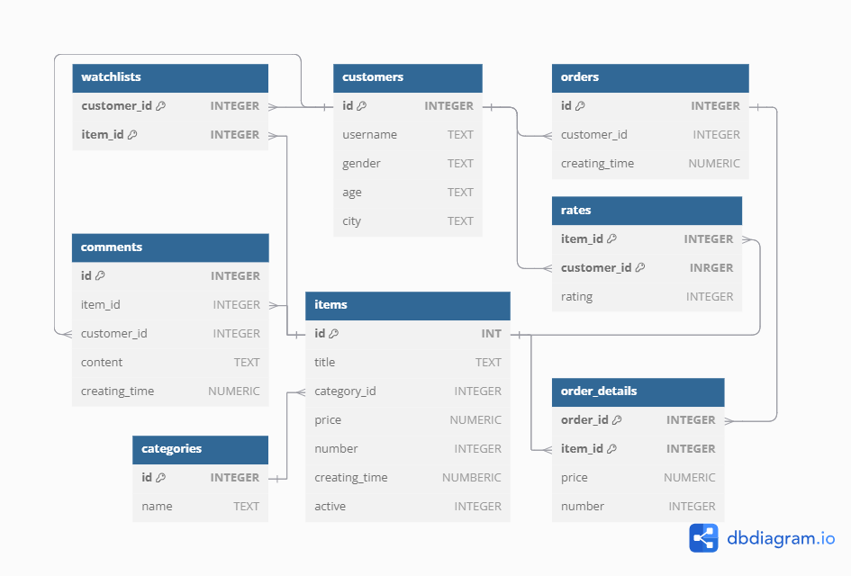

# Design Document

By Jiahui Lin

Video overview: <URL HERE>

## Scope

This database is specially designed for an online shop to track and store data related to basic user information, items, orders, item prices, customer rates and watchlists. The data can be used to conduct an analysis of the consumer behaviors and shopping habits.

* **Users** includes basic user information for system that can track their orders, watchlists, comments and user ratings.
* **Items** includes item information for customers to browse.
* **Categories** includes different categories for items to help customers find items.
* **Orders** includes unique user-order pairs that the system can track orders.
* **Order details** includes order-item pairs and their detailed information: price and number of items ordered.
* **Comments** includes user-item pairs and comments corresponding to user-item pairs.
* **Rates** includes unique user-item pairs and ratings corresponding to user-item pairs.
* **Watchlists** includes user-item pairs that can track which items customers are watching.

The goal of the database is to track user's orders, ratings, comments, and items and categories of interest, and to analyze customer behavior and shopping habits. Some information including item description, user's detailed information (like name, contact information), or shipping status are not our concern for analyst, or some are sensitive such as income, biometric information. They are outside the scope of this database.

## Functional Requirements

This database can be used to:

* Create new customers with their information, which can be ustilized for analyst.
* Create new items for customers to browse, show the available items and find the items by category.
* Track orders and their detailed information. 
* Filter the items purchased by customers or items they are interested in based on their personal information.
* Compute the user ratings for items.

The shop does not support replying to customer questions in comments and they can raise questions by sending emails. This database does not contain detailed information not related to analyst.

## Representation

This databse is built in SQLite wiht the following entities and relationship:

### Entities

<!-- * Which entities will you choose to represent in your database?
     * What attributes will those entities have?
     * Why did you choose the types you did?
     * Why did you choose the constraints you did? -->

#### Customers
The `customers` table includes:
* `id` represents the unique ID for each customer. This column has the `PRIMARY KEY` constraint applied, setting the ID to a unique `INTEGER`.
* `username` represents the unique username for each customer. Each field in this column is `UNIQUE` and set to `TEXT`.
* `gender` represents the customer's gender. Each field in this column is set to `TEXT`.
* `age` represents the customer's age. Each field in this column is set to an `INTEGER`.
* `city` represents the city where the customer lives.  Each field in this column is set to `TEXT`.

#### Items
The `items` table includes:
* `id` represents the unique ID for each item. This column has the `PRIMARY KEY` constraint applied, setting the ID to a unique `INTEGER`.
* `customer_id` 
* `title` represents the item title. Each field in this column is set to `TEXT`.
* `category_id`
* `price` represents the item price.  Each field in this column is set to `NUMERIC`, and has the `CHECK` constraint that only allows `price` above 0.
* `number` represents the number of each item. Each field in this column is set to `INTEGER`, and has the `CHECK` constraint that only allows `number` above 0.
* `creating_time` represents the time when the item was created at. By default, each field in this column is set to the timestamp when the item was created using `DEFAULT CURRENT_TIMESTAMP`.
* `avilable` represents the item status. Each field in this column is set to an `INTEGER`, but with the `CHECK` constraint to ensure that `avilable` is 0 or 1, indicating that the item is avilable or not.

#### Categories
The `categories` table includes:
* `id` represents the unique ID for each category. This column has the `PRIMARY KEY` constraint applied, setting the ID to a unique `INTEGER`.
* `name` represents the item category name. Each field in this column is set to `TEXT`.

#### Orders
The `orders` table includes:
* `id` represents the unique ID for each order. This column has the `PRIMARY KEY` constraint applied, setting the ID to a unique `INTEGER`.
* `customer_id`
* `creating_time` represents the time when the order was created at. By default, each field in this column is set to the timestamp when the order was created using `DEFAULT CURRENT_TIMESTAMP`.

#### Order details
The `order_details` table includes:
* `order_id`
* `item_id`
* `price` 
* `number`

#### Comments
The `comments` table includes:
* `id` represents the unique ID for each comment. This column has the `PRIMARY KEY` constraint applied, setting the ID to a unique `INTEGER`.
* `customer_id`
* `item_id`
* `content` represents the content for each comment. Each field in this column is set to `TEXT`.
* `creating_time` represents the time when the comment was created at. By default, each field in this column is set to the timestamp when the comment was created using `DEFAULT CURRENT_TIMESTAMP`.

#### Rates
The `rates` table includes:
* `item_id`
* `customer_id`
* `rating` represents

#### Watchlists
The `watchlists` table includes:
* `customer_id`
* `item_id`

### Relationships

<!-- Include your entity relationship diagram and describe the relationships between the entities in your database. -->
This relationships between the entities in this database are described in the fowllowing entity relationship diagram:

*
*

## Optimizations

<!-- * Which optimizations (e.g., indexes, views) did you create? Why? -->

## Limitations

<!-- * What are the limitations of your design?
     * What might your database not be able to represent very well? -->
Other useful information, such as which items customers viewed, is not considered in this database.
他們可能點錯商品只停留幾秒鐘並無興趣，或可能在沒興趣的商品掛機。
或許需要其他資訊來判別他們在停留的商品是否真的有興趣

Customers cannot reply to the specific user's comment in comment area 或許要用標記的
想要創建在評論區的評論再開一小塊評論讓用戶們互動，但有點複雜

在TRANSACTION中無法設置變數來重複使用
無法同時使用COMMIT與ROLLBACK

I want to the views to show the current orders and hisory orders (顧客已收到商品並沒問題)
所以要在trigger中加入